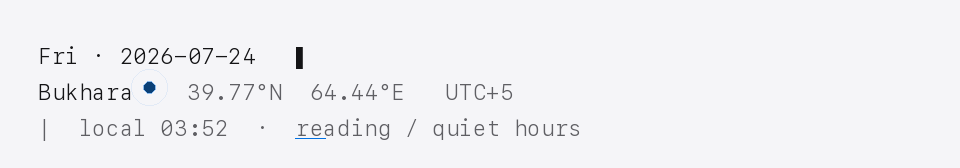
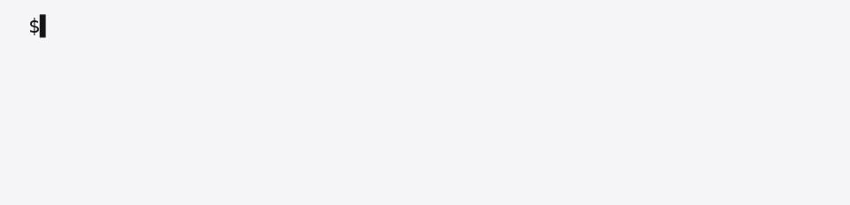

# Shahboz Munirov

<picture>
  <source media="(prefers-color-scheme: dark)" srcset="assets/floating-banner-dark.gif">
  <source media="(prefers-color-scheme: light)" srcset="assets/floating-banner-light.gif">
  
</picture>

<picture>
  <source media="(prefers-color-scheme: dark)" srcset="assets/terminal-loop-dark.gif">
  <source media="(prefers-color-scheme: light)" srcset="assets/terminal-loop-light.gif">
  
</picture>

---

## Stack

  
  
  
  
  
  
  
  
  
  
  
  
  
  
  
  
  
  

## Currently learning

  
  
  
  

## Shipped

| Project | Stack | Links |
| --- | --- | --- |
| **[feathers-board](https://github.com/shakhbozmn/feathers-board)** — FeathersJS v5 API playground. |   | [repo](https://github.com/shakhbozmn/feathers-board) · [npm](https://www.npmjs.com/package/feathers-playground) |
| **[4work](https://github.com/shakhbozmn/4work)** — Two-sided portfolio marketplace. |   | [repo](https://github.com/shakhbozmn/4work) |
| **[Scrap Fortress](https://github.com/shakhbozmn/scrap-fortress)** — Unity tower defense. |   | [repo](https://github.com/shakhbozmn/scrap-fortress) |
| **[flight-delay-prediction](https://github.com/shakhbozmn/flight-delay-prediction)** — ML pipeline classifying U.S. flight records as high/normal delay risk. |    | [repo](https://github.com/shakhbozmn/flight-delay-prediction) |

## Latest

<!-- FLIGHT_RECORDER:START -->
**Latest public transmission:** [feathers-board](https://github.com/shakhbozmn/feathers-board) · JavaScript · updated 2026-07-19
<!-- FLIGHT_RECORDER:END -->

## Connections

  <a href="https://t.me/shahbozms" target="_blank" rel="noopener" style="display:inline-block;width:230px;margin:8px;padding:14px 18px;border:1px solid #26A5E4;border-left:6px solid #26A5E4;border-radius:6px;text-align:left;text-decoration:none;color:#0b1220;background:#f6fbfd;font-family:ui-monospace,monospace;font-size:13px;vertical-align:top">
    
📨 telegram

    
reply ≤ 2h

    
▌▌▌▌▌▌▌▌

    
t.me/shahbozms →

  </a>
  <a href="mailto:shakhbozmn@gmail.com" style="display:inline-block;width:230px;margin:8px;padding:14px 18px;border:1px solid #EA4335;border-left:6px solid #EA4335;border-radius:6px;text-align:left;text-decoration:none;color:#0b1220;background:#fef6f4;font-family:ui-monospace,monospace;font-size:13px;vertical-align:top">
    
✉ email

    
reply ≤ 24h

    
▌▌▌▌▌

    
shakhbozmn@gmail.com →

  </a>
   
  <a href="https://linkedin.com/in/shahbozms" target="_blank" rel="noopener" style="display:inline-block;width:230px;margin:8px;padding:14px 18px;border:1px solid #0A66C2;border-left:6px solid #0A66C2;border-radius:6px;text-align:left;text-decoration:none;color:#0b1220;background:#f4f8fd;font-family:ui-monospace,monospace;font-size:13px;vertical-align:top">
    
in linkedin

    
DMs by appt.

    
▌▌▌▌

    
/in/shahbozms →

  </a>
  <a href="https://shahbozms.uz" target="_blank" rel="noopener" style="display:inline-block;width:230px;margin:8px;padding:14px 18px;border:1px solid #34A853;border-left:6px solid #34A853;border-radius:6px;text-align:left;text-decoration:none;color:#0b1220;background:#f4fbf6;font-family:ui-monospace,monospace;font-size:13px;vertical-align:top">
    
▸ website

    
long-form only

    
▌▌▌▌▌

    
shahbozms.uz →

  </a>

