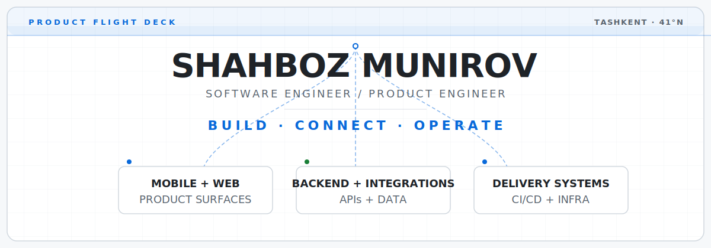

# Shahboz Munirov

Current roles — **Software Engineer at EPAM Systems · Product Engineer at Gnezdo Travel**

<picture>
  <source media="(prefers-color-scheme: dark)" srcset="assets/product-flight-deck-dark.svg">
  <source media="(prefers-color-scheme: light)" srcset="assets/product-flight-deck-light.svg">
  
</picture>

I turn product ambiguity into software people use — across mobile experiences, web products, backend systems, and delivery pipelines.

[Explore products](#shipped-missions) · [Inspect code](#systems-i-build) · [Website](https://shahbozms.uz/) · [Connect](#open-channel)

## 60-second scan

- Based in Tashkent, Uzbekistan.
- Software Engineer at EPAM Systems; Product Engineer building Gnezdo Travel.
- Product scope: mobile, web, backend, integrations, and delivery systems.
- Core toolkit: TypeScript, React Native, Expo, React, Next.js, Node.js, FeathersJS, MongoDB, Redis/BullMQ, Firebase, Docker, CI/CD.
- Strength: turn ambiguous product problems into reliable cross-platform systems.

## Current mission

**Gnezdo Travel** — a travel-tech product spanning booking, property operations, and channel integrations.

`Product engineering` · `React / Next.js` · `FeathersJS` · `MongoDB` · `Queues`

## Shipped missions

**01 / feathers-board — Developer tools**
Interactive FeathersJS v5 API playground in embedded and standalone modes, with service discovery, schema visualization, dynamic requests, and response inspection.
[Source](https://github.com/shakhbozmn/feathers-board) · [Package](https://www.npmjs.com/package/feathers-playground) · [Docs](https://github.com/shakhbozmn/feathers-board/blob/main/USAGE.md)

**02 / 4work — Marketplace systems**
Portfolio marketplace built with Django, PostgreSQL, and Redis; shows client/freelancer roles, project/application lifecycle, RBAC boundaries, Docker, and CI.
[Source](https://github.com/shakhbozmn/4work)

**03 / Scrap Fortress — Game systems**
Unity/C# third-person survival tower-defense project with escalating waves, scrap economy, tower placement/upgrades, and complete game loop.
[Source](https://github.com/shakhbozmn/scrap-fortress)

**04 / Widly — Event products**
Express/Pug/SCSS event-planning application organized around MVC and event CRUD flows.
[Source](https://github.com/shakhbozmn/widly)

## Systems I build

**BUILD** — product UX, React Native mobile, responsive web.
**CONNECT** — APIs, auth, integrations, realtime behavior.
**OPERATE** — queues, storage, observability, CI/CD.

## Flight recorder

Tracks latest public work from featured repositories.

<!-- FLIGHT_RECORDER:START -->
**Latest public transmission:** [feathers-board](https://github.com/shakhbozmn/feathers-board) · JavaScript · updated 2026-07-19
<!-- FLIGHT_RECORDER:END -->

## Off-duty telemetry

- CS2 strategy and team coordination.
- Tennis competition.
- Travel for places, food, and product observations.
- Game systems and polished UI motion.

## Open channel

- [Website](https://shahbozms.uz/)
- [LinkedIn](https://linkedin.com/in/shahbozms)
- [Telegram](https://t.me/shahbozms)
- [Email](mailto:shakhbozmn@gmail.com)
- [Instagram](https://instagram.com/shahbozms)

Building thoughtful products from Tashkent to anywhere.
